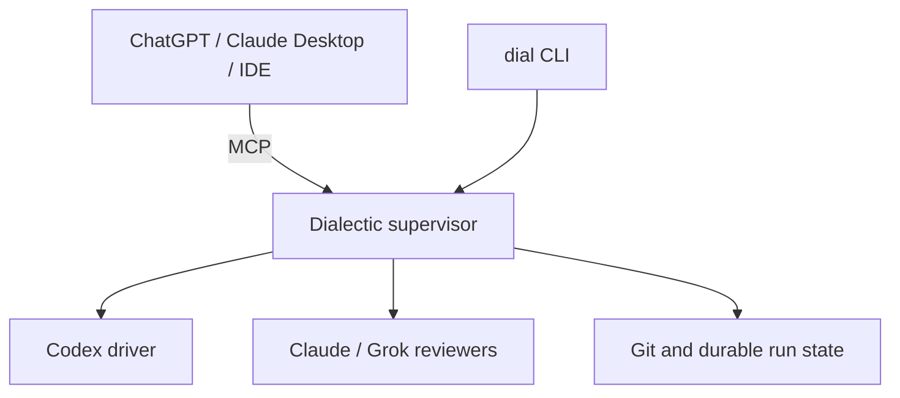
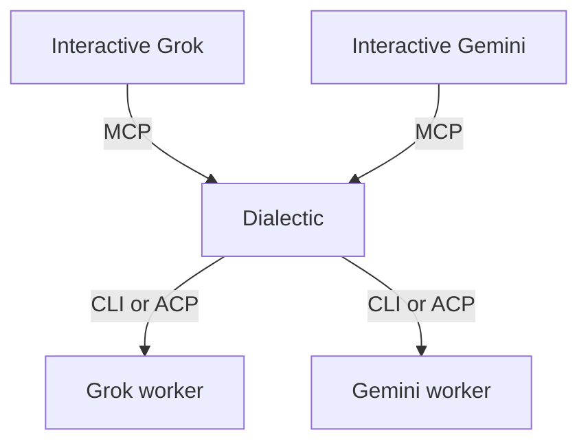

# Dialectic: MCP, ACP, Grok Build, and Gemini

**Compiled:** 2026-08-27  
**Project:** Dialectic (`dial`)

This document records the two architecture answers covering:

1. Whether Dialectic should use MCP and how it compares with chat-led shell-script orchestration.
2. Grok Build's MCP and ACP capabilities, plus a future Gemini integration.

---

# 1. How MCP Should Fit Dialectic

MCP is probably the right interaction layer for Dialectic, but at one specific seam:

> **Use MCP to let ChatGPT, Claude Desktop, IDEs, and other clients operate Dialectic. Do not use it as an uncontrolled peer-to-peer chat bus between models.**



MCP would not replace `dial`; both interfaces would call the same underlying Python application service.

## The quoted Claude-to-Grok setup

The described setup is excellent for personal, discretionary delegation:

- Claude notices it wants a second opinion.
- Claude runs a narrow script.
- Grok answers.
- Claude incorporates the result.

But that is a different product from Dialectic:

| Chat-led delegation | Dialectic |
|---|---|
| Claude decides whether Grok runs | Policy guarantees configured reviewers run |
| Claude Desktop session owns progress | Supervisor owns durable progress |
| General shell access | Narrow, allowlisted operations |
| Mostly prose responses | Schema-validated reports |
| Flexible number of calls | Hard round, time, and cost limits |
| Limited auditability | Every run, prompt, model, and result recorded |
| One model interprets the result | Deterministic arbitration rules |

The claim that “letting the AI decide” is always more powerful is only half-right. It is useful for research. It is undesirable for a review gate: the driver must not decide whether its work deserves review.

The preferred rule is:

> A model may decide what to ask during its allocated turn. Dialectic decides whom it may ask, whether the call is required, how many calls are allowed, and what authority the answer has.

## Recommended Dialectic MCP surface

Keep the interface coarse-grained:

| MCP operation | Purpose |
|---|---|
| `start_code_once` | Start driver → reviewers → repair |
| `start_council` | Start bounded multi-model discussion |
| `get_run` | Return progress, state, and final verdict |
| `get_artifact` | Retrieve a review or council report |
| `cancel_run` | Stop the run and its owned processes |
| `list_capabilities` | Show configured model aliases and modes |

`start_code_once` should accept a registered `repo_id`, not an arbitrary shell command or unrestricted path. Models should be selected from configured aliases rather than arbitrary executable strings.

Long-running calls should return a durable `run_id` immediately. Clients can poll `get_run`; later, Dialectic can use MCP's optional Tasks facility when both client and server support it. MCP itself deliberately defines context and tool exchange, not orchestration, persistence, quorum, or model behavior. Those remain Dialectic responsibilities.

Official references:

- [MCP architecture](https://modelcontextprotocol.io/docs/2026-07-28/learn/architecture)
- [MCP specification](https://modelcontextprotocol.io/specification/2026-07-28)

## Council mode through MCP

The models still should not contact one another freely. Dialectic routes controlled messages:

1. A host calls `start_council`.
2. Dialectic independently gathers initial positions.
3. Dialectic constructs the cross-examination packet.
4. Each participant receives only the permitted material.
5. Dialectic enforces the deadline and iteration limit.
6. Ballots are parsed and consensus is calculated by the controller.
7. The host receives the final report.

That produces the experience of a debate without surrendering cost control, blindness, or reproducibility.

## Why a narrow MCP server beats general desktop shell access

Giving a desktop AI general shell access is convenient, but it also gives repository content and model-generated text a route to powerful local commands. For Dialectic—especially around broker or execution code—it is safer to expose five constrained operations than a universal `run_shell` capability.

Claude Desktop and Claude Code can consume local MCP servers over `stdio`; Claude Code can also expose its own tools with `claude mcp serve`. For Dialectic's reviewer role, however, native `claude -p` with strict structured output is simpler and more deterministic than turning Claude Code itself into an MCP worker.

- [Claude Code MCP documentation](https://code.claude.com/docs/en/mcp)

On the OpenAI side, ChatGPT Developer mode and the Responses API support remote MCP tools. ChatGPT's route is a remotely reachable MCP endpoint rather than an arbitrary local shell process, so Dialectic would eventually expose authenticated Streamable HTTP or use a suitable private tunnel.

- [ChatGPT Developer mode](https://developers.openai.com/api/docs/guides/developer-mode)
- [MCP tools in the Responses API](https://developers.openai.com/api/docs/guides/tools-connectors-mcp)

Two corrections to the quoted alternatives:

- Custom GPT Actions call REST APIs described by an OpenAPI schema; they do not directly run a local script. They could call an HTTPS Dialectic service. [GPT Actions](https://developers.openai.com/api/docs/actions/introduction)
- The Assistants API recommendation is obsolete: OpenAI's migration page lists its shutdown as August 26, 2026. New integrations should use the Responses API. [Assistants migration](https://developers.openai.com/api/docs/assistants/migration)

## MVP recommendation

Keep MCP out of the current MVP's critical path:

1. Build and verify the `dial` CLI and deterministic supervisor.
2. Keep Codex, Claude, and Grok behind native CLI adapters.
3. Once Code Once and Council Once pass their tests, add a thin MCP facade over those same application methods.
4. Put no workflow logic in the MCP adapter.

The verdict is:

> **Yes to MCP as Dialectic's universal front door. No to making Claude Desktop, ChatGPT, or any individual model the durable orchestrator.**

The shell-script setup is a good prototype of the user experience. Dialectic turns that idea into a bounded, model-neutral, auditable system.

---

# 2. Grok MCP, ACP, and Future Gemini Support

Grok makes the protocol boundary even clearer:

> **MCP makes Dialectic a tool that agents can call. ACP or headless CLI makes Grok and Gemini workers that Dialectic can control.**

| Direction | Best interface |
|---|---|
| ChatGPT, Claude, Grok, Gemini, or an IDE → Dialectic | MCP |
| Dialectic → Grok or Gemini | Headless CLI initially |
| Dialectic → persistent Grok or Gemini agent | ACP later |
| Dialectic → raw hosted model | Provider API, optionally |

## What Grok supports

Grok Build has substantial MCP-client support:

- Local `stdio`, remote HTTP/SSE, and Streamable HTTP servers.
- User- and project-scoped configuration.
- OAuth handling.
- Enable, disable, inspect, and diagnose commands.
- Permission rules for individual MCP tools.
- Compatibility with `.mcp.json`, Claude, and Cursor MCP configurations.
- MCP inheritance controls for subagents.

[Grok Build MCP documentation](https://github.com/xai-org/grok-build/blob/main/crates/codegen/xai-grok-pager/docs/user-guide/07-mcp-servers.md)

Interactive Grok could invoke Dialectic with something resembling:

```bash
grok mcp add dialectic -- dial mcp serve
```

Grok would then see narrow tools such as `dialectic__start_council` and `dialectic__get_run`.

However, Grok's documented direction is:

- **MCP client:** Grok calls external tools.
- **ACP server:** External software controls Grok.

For the second direction, Grok exposes a long-lived ACP agent over `stdio` or authenticated WebSocket:

```bash
grok agent stdio
```

ACP provides sessions, prompts, streaming replies, tool-call updates, and permission requests. [Grok Build agent mode](https://github.com/xai-org/grok-build/blob/main/crates/codegen/xai-grok-pager/docs/user-guide/15-agent-mode.md)

For the MVP, `grok -p` remains simpler. ACP becomes attractive later when Dialectic needs persistent sessions, streaming progress, or lower subprocess startup overhead.

## Corrected Grok structured-output finding

Grok Build added native `--json-schema` support in version 0.2.67. It can now return schema-constrained review and council objects rather than merely putting prose inside a generic JSON envelope. [Grok Build changelog](https://x.ai/build/changelog)

The Grok adapter should:

1. Detect `--json-schema` support during preflight.
2. Supply Dialectic's review or council schema.
3. Parse the structured result.
4. Validate it independently with Pydantic or JSON Schema.
5. Reject malformed output even if Grok claimed structured-output success.
6. Fall back to prompting plus local validation only for older compatible versions.

This corrects the earlier conclusion that Grok's CLI lacked native schema-constrained output.

Grok also has useful review-isolation controls:

```bash
grok -p "Review this change" \
  --tools "read_file,grep,list_dir" \
  --no-subagents \
  --max-turns 8
```

Its headless mode supports session resume, tool allowlists, permission rules, JSON streaming, and session IDs. [Grok headless documentation](https://github.com/xai-org/grok-build/blob/main/crates/codegen/xai-grok-pager/docs/user-guide/14-headless-mode.md)

## Gemini fits the same architecture

Gemini CLI is also:

- An MCP client supporting `stdio`, SSE, and Streamable HTTP.
- A headless agent supporting JSON and streaming JSON output.
- An ACP agent server through `gemini --acp`.
- A repository-aware coding agent with tools and policy controls.

Official references:

- [Gemini CLI MCP](https://geminicli.com/docs/tools/mcp-server/)
- [Gemini headless mode](https://geminicli.com/docs/cli/headless/)
- [Gemini ACP mode](https://geminicli.com/docs/cli/acp-mode/)

Gemini could therefore operate on either side:



Conceptually, Gemini could install the same server with:

```bash
gemini mcp add dialectic dial mcp serve
```

Dialectic could include Gemini naturally as a council participant:

```yaml
council:
  participants:
    - codex
    - claude
    - grok
    - gemini
```

Or as another reviewer:

```yaml
code:
  driver: codex
  reviewers:
    - "@driver"
    - claude
    - grok
    - gemini
```

Gemini CLI's current JSON mode provides a machine-readable envelope, but its public CLI documentation does not presently describe a Claude/Grok-style custom output-schema flag. A Gemini CLI adapter should therefore request JSON in the prompt and validate it locally.

The Gemini API is the stronger alternative when native schema enforcement matters. Its current Interactions API supports structured outputs, stored conversational state, background execution, and continuation through a previous interaction ID.

- [Gemini Interactions API](https://ai.google.dev/gemini-api/docs/interactions-overview)
- [Gemini structured outputs](https://ai.google.dev/gemini-api/docs/structured-output)

Gemini CLI can use cached Google-account authentication in headless mode. Google currently documents daily allowances of 1,000 requests for the individual free offering, 1,500 for Google AI Pro, and 2,000 for Google AI Ultra. API-key or Vertex authentication remains the uninterrupted pay-as-you-go route.

- [Gemini authentication](https://geminicli.com/docs/get-started/authentication/)
- [Gemini CLI quotas](https://geminicli.com/docs/resources/quota-and-pricing/)

For shared project instructions, keep `AGENTS.md` canonical:

```markdown
<!-- GEMINI.md -->
@AGENTS.md
```

Gemini officially supports imports from `GEMINI.md`. [Gemini context imports](https://geminicli.com/docs/reference/memport/)

## Essential isolation rule

Maintain separate agent profiles:

| Profile | Dialectic MCP available? | Repository rights |
|---|---:|---|
| Interactive Grok or Gemini | Yes | User-controlled |
| Dialectic reviewer worker | No | Read-only |
| Dialectic driver worker | No | Isolated writable worktree |

A reviewer launched by Dialectic must not inherit the user's personal MCP configuration—especially not the Dialectic server itself. Otherwise a reviewer could recursively start councils, launch further coding runs, or reach unrelated personal tools.

Models should never call each other directly. They receive controlled packets from Dialectic and return schema-constrained results.

## Adapter architecture

Make three architectural provisions now:

- Call the abstraction `AgentAdapter`, not `CliAdapter`.
- Give adapters declared capabilities such as `resume`, `structured_output`, `repo_read`, `repo_write`, and `streaming`.
- Keep transport separate from model identity: `cli`, `acp`, or `api`.

Conceptual configuration:

```yaml
models:
  codex:
    provider: openai
    transport: codex_cli

  claude:
    provider: anthropic
    transport: claude_cli

  grok:
    provider: xai
    transport: grok_cli

  gemini:
    provider: google
    transport: gemini_cli
```

## Recommended evolution

The MVP remains CLI-first:

1. MVP: Codex, Claude, and Grok subprocess adapters.
2. Correct the Grok adapter to use native `--json-schema` when available.
3. Add Gemini as another subprocess adapter.
4. Add the Dialectic MCP facade.
5. Implement one reusable ACP transport for Grok and Gemini.
6. Add direct APIs where schema reliability or quota continuity justifies separate billing.

Gemini requires no change to Dialectic's core workflow. It becomes another selectable driver, reviewer, council participant, or moderator.

---

# Consolidated conclusion

- Use **MCP northbound** so interactive AI applications and IDEs can operate Dialectic.
- Use **headless CLIs southbound** for the MVP.
- Consider **ACP southbound** for persistent Grok and Gemini sessions later.
- Keep Dialectic—not any model—as the durable supervisor and policy authority.
- Do not permit direct or recursive model-to-model tool calls in Code Once or Council Once.
- Add Gemini through the same provider-neutral `AgentAdapter` contract.
- Prefer Grok's native `--json-schema` support when available, while retaining local validation.
